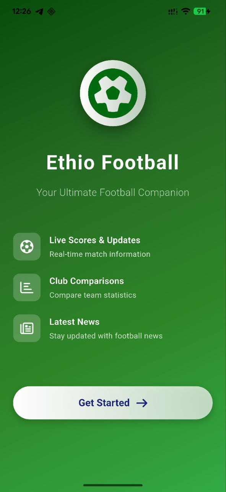
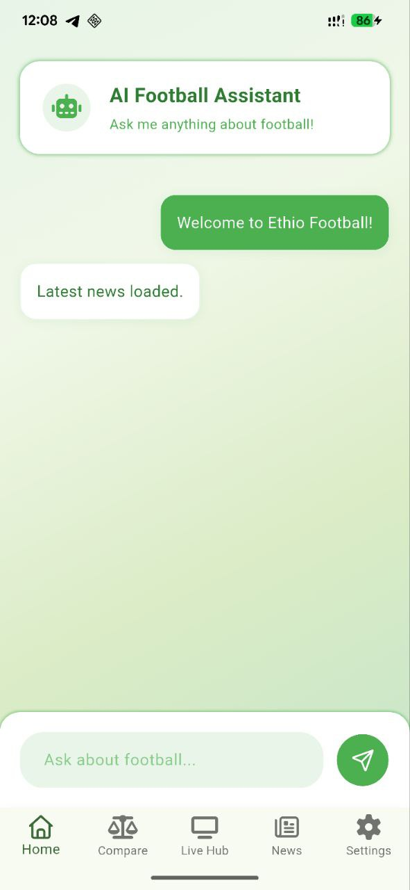
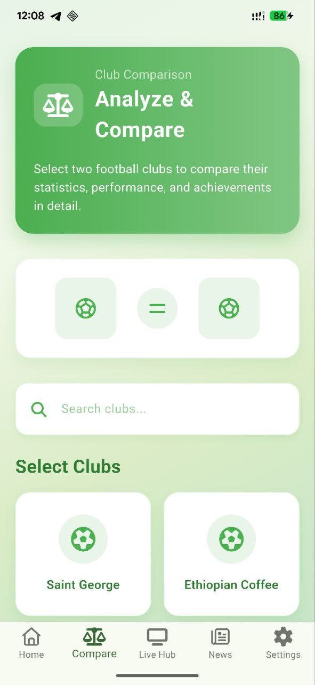
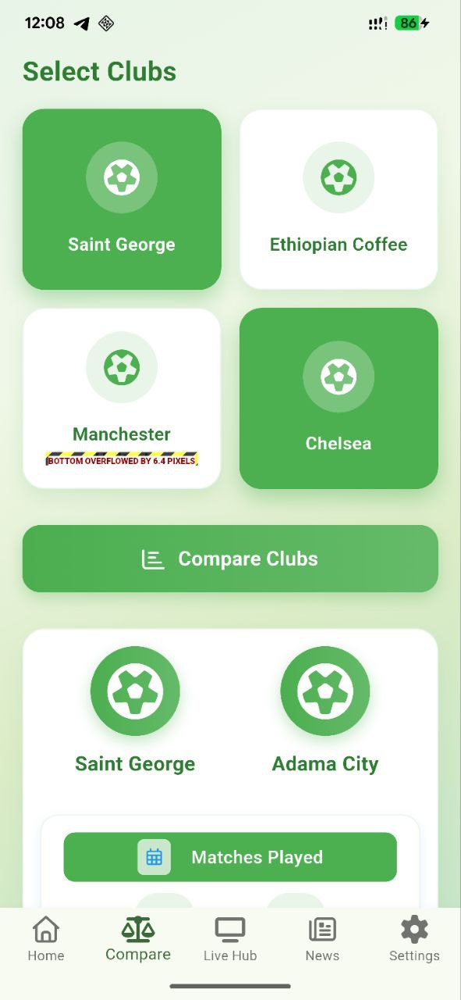
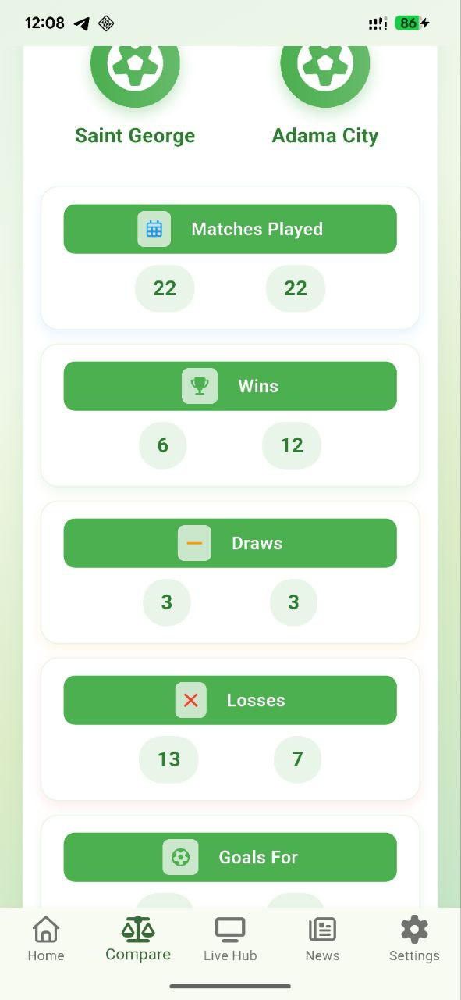
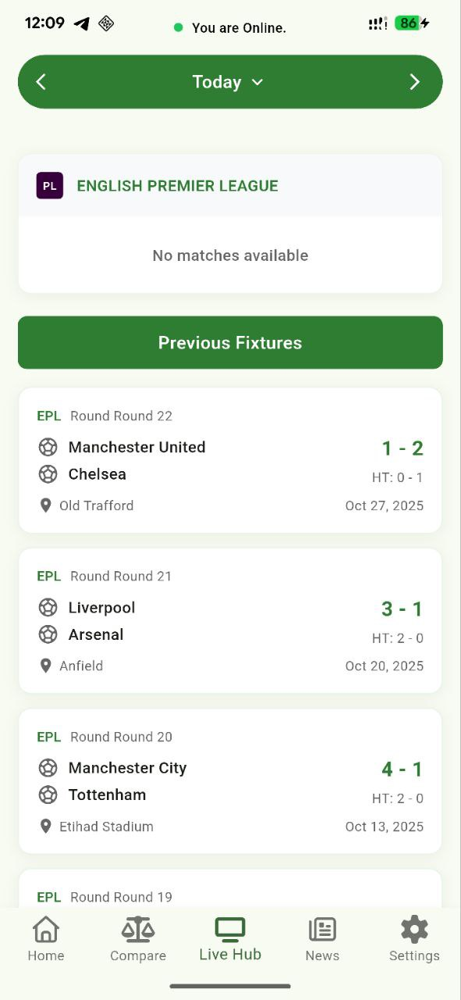
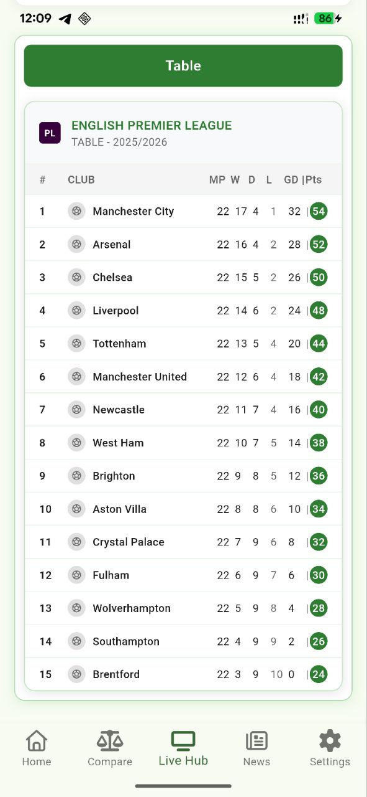
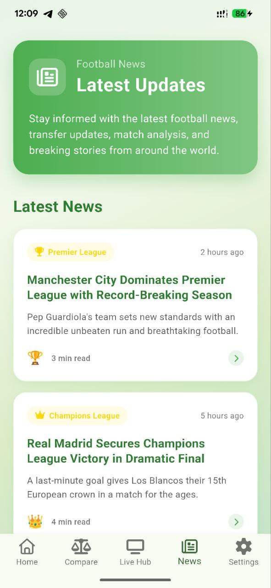
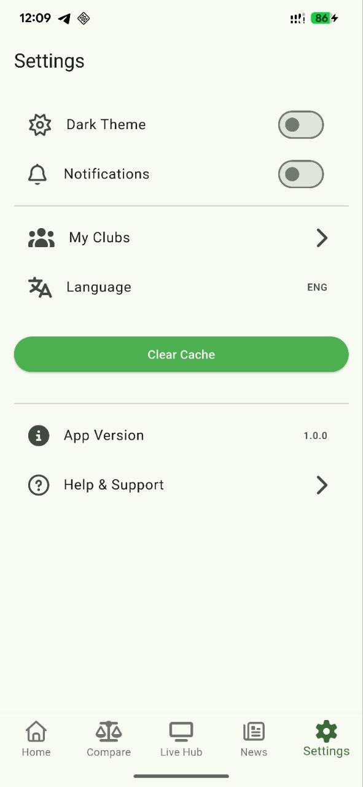

# EthioFootball: AI-Powered Football Companion for Ethiopian Fans

## 🌟 Overview

**EthioFootball** is an ambitious project designed to bridge the digital gap for Ethiopian football fans by providing a comprehensive, reliable, and AI-powered platform that combines football information from both the Ethiopian Premier League and the English Premier League in one place.

It empowers millions of fans to easily follow both leagues, access real-time match statistics, explore team and player data, and stay up to date with news and fixtures — all through a single, seamless experience.

Our core innovation is a **GenAI Chat Interface** that delivers immediate, accurate, and up-to-date answers on league standings, match results, news, and historical data, fostering accessibility, engagement, and a data-driven sports culture for Ethiopian fans.

## 📝 Table of Contents

- [The Challenge](#the-challenge)
- [The Solution](#the-solution)
- [Key Features](#key-features)
- [Mobile App Screenshots](#mobile-app-screenshots)
- [Technology Stack for Mobile App](#technology-stack-for-mobile-app)
- [Project Structure](#project-structure)
- [Getting Started](#getting-started)
- [Contributing](#contributing)

## 🎯 The Challenge

Football is at the heart of Ethiopian culture — yet the digital football experience for fans remains fragmented and unreliable.

Currently, Ethiopian football enthusiasts face major barriers:

**No Unified Platform:** Fans must use separate platforms to follow the Ethiopian Premier League and the English Premier League, making it hard to stay connected to both.

**Unreliable Data:** Local league information is often outdated or inaccurate, while global sources rarely include Ethiopian football data.

**Limited Accessibility:** Many platforms require strong internet connections, leaving fans in low-connectivity areas without real-time updates.

**Missed Engagement Opportunities:** The absence of a centralized, credible, and interactive football app limits fan engagement, content creation, and sports entrepreneurship.

As a result, millions of passionate Ethiopian fans lack a single, trustworthy, and interactive platform that brings together local and global football updates in real time.

## ✅ The Solution

EthioFootball directly addresses these challenges by creating a unified, intelligent football companion tailored for Ethiopian fans.

It combines the Ethiopian Premier League and the English Premier League into one user-friendly, AI-powered platform — designed for accessibility, reliability, and engagement.

Key innovations include:

**GenAI Chat Interface:** Delivers instant, conversational answers to questions about teams, players, fixtures, and historical data — personalized for Ethiopian fans.

**Unified Football Access:** Provides real-time data, match results, and news for both local and global leagues in one integrated application.

**Ubiquitous Access:** Available on both mobile and web, ensuring a broad reach for our target audience (Ethiopian football enthusiasts aged 15-45).

**Offline Support:** Ensures critical information like standings and stats remain accessible even in low-connectivity environments.

**Trusted Data Source:** Centralizes accurate, verified updates to combat misinformation and strengthen the credibility of Ethiopian football coverage.

## ✨ Key Features
| Feature                 | Description                                                                                             |
| :---------------------- | :------------------------------------------------------------------------------------------------------ |
| **GenAI Chat Interface**    | Conversational AI to answer complex and historical football queries instantly.                           |
| **Match Updates & Predictions** | Real-time score updates, live commentary, and intelligent match result predictions.                 |
| **Offline Mode**            | Key data (e.g., league tables, team info) is cached for seamless access with low or no internet connectivity. |
| **Team Info & Stats**       | Detailed statistics, player profiles, historical performance data, and team comparisons.                   |
| **News Feed**               | Curated, reliable news and updates for the Ethiopian Premier League and English Premier League.       |

## 📱 Mobile App Screenshots

| Welcome Screen           | Chat Interface           |
| :----------------------- | :----------------------- |
|  |  |

| Compare Page 1           | Compare Page 2           | Compare Page 3           |
| :----------------------- | :----------------------- | :----------------------- |
|  |  |  |

| Live Hub 1               | Live Hub 2               |
| :----------------------- | :----------------------- |
|  |  |

| News Page                | Settings Page            |
| :----------------------- | :----------------------- |
|  |  |

## 🛠 Technology Stack for Mobile App

| Component          | Technology  | Primary Language | Directory |
| :----------------- | :---------- | :--------------- | :-------- |
| **Mobile Application** | Flutter     | Dart             | `mobile/` |
| **Backend/API**    | Gin         | Go               | `backend/` |

## 📂 Project Structure

The repository is organized into distinct directories for each major component:

## 🚀 Getting Started

Follow these steps to set up the project locally.

### Prerequisites

*   [Go](https://go.dev/doc/install) (for the backend)
*   [Flutter SDK](https://flutter.dev/docs/get-started/install) (for the mobile app)
*   [Node.js and npm/yarn](https://nodejs.org/en/download/) (for the web app)

### Installation

1.  **Clone the repository:**
    ```bash
    git clone https://github.com/A2SV/g6-ethio-football.git
    cd g6-ethio-football
    ```

2.  **Set up the Backend:**
    ```bash
    cd backend
    # Follow backend-specific instructions here (e.g., go mod download, database setup)
    # E.g., go run main.go
    ```
    ***Note:*** *Add specific backend setup instructions (e.g., environment variables, database configuration) here.*

3.  **Set up the Mobile App:**
    ```bash
    cd mobile
    flutter pub get
    flutter run
    ```

4.  **Set up the Web App:**
    ```bash
    cd web
    npm install # or yarn install
    npm start   # or yarn start
    ```
    ***Note:*** *Add specific web setup instructions here.*

## 🤝 Contributing

Contributions are welcome! If you discover a bug or have a feature request, feel free to open an issue or submit a pull request.

1.  Fork the repository.
2.  Create your feature branch (`git checkout -b feature/AmazingFeature`).
3.  Commit your changes (`git commit -m 'Add some AmazingFeature'`).
4.  Push to the branch (`git push origin feature/AmazingFeature`).
5.  Open a Pull Request.
